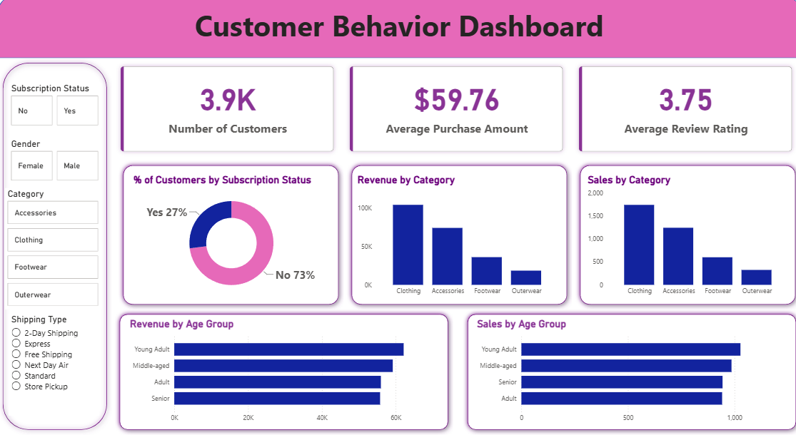

# Customer Shopping Behavior Analysis

An end-to-end analytics project on 3,900 retail customer transactions: data cleaning in **Python**, business analysis in **SQL**, and an interactive **Power BI** dashboard.



## Business Problem

A retail business wants to understand who its customers are, what they buy, and which factors (subscriptions, discounts, shipping) relate to higher spending. This project answers those questions using purchase data and presents the results in a dashboard that non-technical users can explore. See `Business Problem Document.pdf` for the full context.

**Questions explored**
- Which product categories and items drive the most revenue?
- Do subscribed customers spend more than non-subscribed customers?
- How do discounts and shipping methods relate to purchase amount?
- How is revenue split across gender and age groups?
- How loyal is the customer base, based on previous purchases?

## Dataset

`customer_shopping_behavior.csv` contains 3,900 rows and 18 columns, including customer age and gender, item and category purchased, purchase amount (USD), location, size, color, season, review rating, subscription status, shipping type, discount and promo code use, previous purchases, payment method and purchase frequency.

## Tools Used

| Tool | Purpose |
| --- | --- |
| Python (Pandas) | Data loading, cleaning and feature creation |
| Jupyter Notebook | Running and documenting the Python analysis |
| SQL (PostgreSQL) | Business analysis queries (also works with MySQL / SQL Server with minor syntax changes) |
| Power BI | Interactive dashboard |
| GitHub | Version control and documentation |

## Project Workflow

### 1. Data Cleaning and Preparation (Python)
Done in `Customer_Shopping_Behavior_Analysis.ipynb`:
- Reviewed the data with `head()`, `info()`, `describe()` and a missing-value check.
- Found 37 missing values in `Review Rating` and filled them with the **median rating of the product category**.
- Renamed columns to snake_case (for example `Purchase Amount (USD)` became `purchase_amount`).
- Created `age_group` by splitting customers into four equal-sized age groups (Young Adult, Adult, Middle-aged, Senior).
- Created `purchase_frequency_days` by converting purchase frequency labels (Weekly, Monthly, Quarterly and so on) into numbers of days.
- Dropped `promo_code_used` after confirming it was identical to `discount_applied`.
- Loaded the cleaned data into a database table named `customer` using SQLAlchemy.

### 2. SQL Analysis
`customer_behavior_sql_queries.sql` contains 10 business queries using `GROUP BY`, aggregate functions, `CASE`, subqueries, CTEs and window functions (`ROW_NUMBER`):

1. Revenue by gender
2. Discount users who spent more than the average purchase amount
3. Top 5 products by average review rating
4. Average spend: Standard vs. Express shipping
5. Subscribers vs. non-subscribers: customers, average spend and total revenue
6. Top 5 products by share of purchases made with a discount
7. Customer segments (New, Returning, Loyal) based on previous purchases
8. Top 3 most purchased products within each category
9. Subscription rate among repeat buyers (more than 5 previous purchases)
10. Revenue contribution by age group

### 3. Power BI Dashboard
`customer_behavior_dashboard.pbix` includes:
- KPI cards: number of customers, average purchase amount, average review rating
- Subscription split (donut chart)
- Revenue and sales by category
- Revenue and sales by age group
- Filters for subscription status, gender, category and shipping type

## Key Findings

| Metric | Result |
| --- | --- |
| Total revenue | $233,081 |
| Average purchase amount | $59.76 |
| Average review rating | 3.75 |
| Subscribed customers | 27% (1,053 of 3,900) |

- **Categories:** Clothing ($104K, 44.7% of revenue) and Accessories ($74K, 31.8%) together generate about 77% of revenue. Footwear contributes 15.5% and Outerwear 7.9%.
- **Subscriptions:** Subscribers spend about the same per purchase as non-subscribers ($59.49 vs. $59.87). Repeat buyers subscribe at a similar rate (27.6%) to customers overall.
- **Gender:** Male customers account for 67.7% of revenue, in line with making up about 68% of customers. Average spend is nearly equal ($59.54 male, $60.25 female).
- **Age groups:** Young Adults contribute the most revenue (26.7%), but the gap to the other groups is small (23.9% to 25.4%).
- **Discounts:** 43% of purchases used a discount. Discounted purchases were not larger on average ($59.28 vs. $60.13 without). Hats, Sneakers and Coats had the highest discount usage (about 49% to 50% of their purchases).
- **Shipping:** Express averaged $60.48 per purchase vs. $58.46 for Standard, a difference of about 3%.
- **Loyalty:** Under the segment definition used here (Loyal = more than 10 previous purchases), 80% of customers are Loyal, 18% Returning and 2% New.

## Business Implications

- Spending is fairly uniform across customer groups, so growth is more likely to come from **category mix and retention** than from targeting one demographic.
- Subscribers do not spend more per purchase, so the subscription program's value may lie in retention and purchase frequency rather than basket size. This would be worth testing.
- Discounts did not increase average purchase size, which suggests reviewing whether broad discounts are worthwhile or whether more targeted promotions would work better.

## Limitations

- The dataset appears to be a clean, sample-style dataset: very little missing data and spending that is almost identical across groups, so the findings show small differences rather than strong patterns.
- The analysis is descriptive. It shows relationships in the data but does not establish cause and effect.

## Repository Structure

```
Customer-shopping-behavior-analysis/
├── Customer_Shopping_Behavior_Analysis.ipynb   # Python cleaning and preparation
├── customer_behavior_sql_queries.sql           # 10 SQL business queries
├── customer_shopping_behavior.csv              # Dataset
├── customer_behavior_dashboard.pbix            # Power BI dashboard
├── dashboard.png                               # Dashboard screenshot
├── Business Problem Document.pdf               # Business context
└── README.md
```

## How to Run

**Python analysis**
```
git clone https://github.com/divyansh282/Customer-shopping-behavior-analysis.git
cd Customer-shopping-behavior-analysis
pip install pandas jupyter
jupyter notebook Customer_Shopping_Behavior_Analysis.ipynb
```
Run the cells in order. The cells that load data into PostgreSQL, MySQL or SQL Server need your own database and password; replace the `your_password` placeholder. All other cells only need the CSV.

**SQL analysis**
1. Create a database in PostgreSQL, MySQL or SQL Server.
2. Load the cleaned data into a table named `customer` (the notebook does this), or import the CSV after applying the cleaning steps above.
3. Run the queries in `customer_behavior_sql_queries.sql`. Some syntax (for example `::numeric`) is PostgreSQL-specific and may need adjusting for other databases.

**Power BI dashboard**
1. Open `customer_behavior_dashboard.pbix` in Power BI Desktop.
2. If prompted, update the data source path to the location of the CSV and refresh.

## Skills Demonstrated

Data cleaning and feature creation (Pandas) · SQL (aggregations, CASE, subqueries, CTEs, window functions) · Dashboard design (Power BI) · Turning data into business insights
